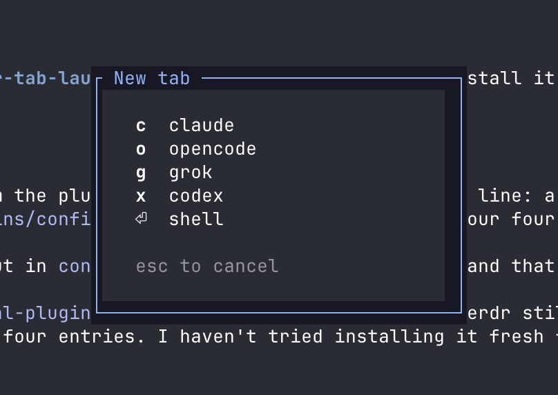

# herdr-tab-launcher

A [herdr](https://herdr.dev) plugin that puts a small menu on your new-tab key. Press one key to open a tab that starts Claude, Codex, or any other command.



- The new tab opens in the directory of the pane you were in, and takes focus.
- **Enter** opens a plain shell. **Esc** or **q** closes the menu without creating a tab.
- Tabs created by agents and scripts through `herdr tab create` never show the menu. Only your keybinding opens it.

## Install

```sh
herdr plugin install johnparkerg/herdr-tab-launcher
```

Then bind the menu in `~/.config/herdr/config.toml`. This setup puts the menu on the default new-tab key and moves the plain new tab to `prefix+shift+c`:

```toml
[keys]
new_tab = "prefix+shift+c"

[[keys.command]]
key = "prefix+c"
type = "plugin_action"
command = "tab-launcher.new-tab"
description = "new tab with launcher"
```

Apply it with `herdr server reload-config`.

Requires `bash` and `jq`. Runs on macOS and Linux.

## Configure the menu

Copy the example into the plugin's config directory and edit it:

```sh
dir="$(herdr plugin config-dir tab-launcher)"
mkdir -p "$dir"
cp "$(herdr plugin list --plugin tab-launcher --json | jq -r '.result.plugins[0].plugin_root')/menu.conf.example" "$dir/menu.conf"
```

Put one entry on each line: a single key, then the command.

```
c claude
x codex --full-auto
d docker compose up
```

The command is typed into the new tab's shell, so aliases, flags and pipelines all work. The menu reads the file each time it opens, so you don't need to reload anything.

## Limitations

- The tab bar's **+ new tab** button and the right-click **New tab** still open a plain tab. Herdr doesn't let plugins take over those, and its `tab.created` event doesn't say whether a person or an agent created the tab.
- If something fails, check `herdr plugin log list --plugin tab-launcher`.

## License

MIT
